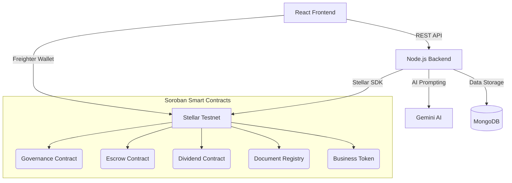

# Fino — Fully Decentralized Investment Platform for Local Businesses


<div align="center">


**Community-powered fractional investment in local businesses, fused with a fully decentralized on-chain DAO — built on Stellar's Soroban smart contract platform. XLM only. Stellar Testnet.**

</div>

---

## 🚀 Deployed Contracts (Stellar Testnet)

**Network:** Stellar Testnet · Passphrase `Test SDF Network ; September 2015`

**Live app:** https://fino-srijon.vercel.app · **Backend API:** https://fino-6e10.onrender.com/api · **Admin wallet:** `GBFONIF2XYE7HCJ5RUSRQRZCCCYGMPKM3XDMUKIQJJPZOAHUGJNDOZDG`

| Contract | Deployed Address (testnet) | Explorer |
|---|---|---|
| **Business Token (Factory)** | `CCGD5P3SCFVBQHQJFG5YEHSDTGZQ27UFUTRGMM5FWT3FFMQ37QA2WIWM` | [view](https://stellar.expert/explorer/testnet/contract/CCGD5P3SCFVBQHQJFG5YEHSDTGZQ27UFUTRGMM5FWT3FFMQ37QA2WIWM) |
| **Escrow Manager** | `CDQJFA7FWAFENCOBGYI5YTEIIIV2JWYWGPKMFTSKZCS3GVSVPSVDULXU` | [view](https://stellar.expert/explorer/testnet/contract/CDQJFA7FWAFENCOBGYI5YTEIIIV2JWYWGPKMFTSKZCS3GVSVPSVDULXU) |
| **Dividend Distributor** | `CDH35PFTCU2WXPQ3LW4NFDJADNCEKK7RNH2UUNH5JRKFZ7O7U3UCFY6C` | [view](https://stellar.expert/explorer/testnet/contract/CDH35PFTCU2WXPQ3LW4NFDJADNCEKK7RNH2UUNH5JRKFZ7O7U3UCFY6C) |
| **Document Registry** | `CAZZHGGQCK4XYSWQOY7NPSU247XMWA4PNJWUA6NU47TPQFK4E6EGVYZZ` | [view](https://stellar.expert/explorer/testnet/contract/CAZZHGGQCK4XYSWQOY7NPSU247XMWA4PNJWUA6NU47TPQFK4E6EGVYZZ) |
| **DAO Governance** | `CCIMHOZAMXQXJRJJXAMBX2GXSGP6BCU7YRLYTJ5IJ446XEJYEW56UBAH` | [view](https://stellar.expert/explorer/testnet/contract/CCIMHOZAMXQXJRJJXAMBX2GXSGP6BCU7YRLYTJ5IJ446XEJYEW56UBAH) |

> Every business gets its own SEP-41 **Business Token** instance (1 token = 1 fractional share, 0 decimals) minted at approval time. All XLM movement — investor deposits, dividend payouts, refunds — is custodied on-chain by the Escrow and Dividend contracts; the backend never holds investor funds itself.

### Smart-contract folder structure

```
smart-contracts/soroban-contracts/
├── Cargo.toml / Cargo.lock          # Rust workspace
├── business-token/src/              # SEP-41 fractional-ownership token (contract.rs, storage.rs, lib.rs)
├── escrow-contract/src/             # Trustless XLM escrow for fundraising campaigns
├── dividend-contract/src/           # Pro-rata XLM dividend payouts (basis-point shares)
├── document-registry/src/           # SHA-256 document hashes, attestations, ZK range proofs
└── governance-contract/src/         # 1-wallet-1-vote DAO (business approval, revenue verification)
```

### Contract ↔ backend function mapping

| Contract fn (Rust) | Caller (Node.js) |
|---|---|
| `business-token.__constructor` / `mint` / `transfer` | `backend/src/services/stellar.service.js` ← `business.controller.js` (approval), `investment.controller.js` (buy) |
| `escrow-contract.deposit` / `release_to_business` / `refund_investor` | `stellar.service.js` ← `investment.controller.js`, `deadlineChecker.service.js` |
| `dividend-contract.deposit_dividend` / `approve_and_distribute` | `dividendDistributor.service.js` ← `dividend.controller.js`, `proposalFinalizer.service.js` |
| `document-registry.register_document` / `add_attestation` / `add_range_proof` | `documentHash.service.js`, `verificationOracle.service.js`, `zkProof.service.js` |
| `governance-contract.create_proposal` / `vote` / `finalize_proposal` | `proposalCreator.service.js`, `governance.controller.js`, `proposalFinalizer.service.js` |

Contract IDs are wired through `backend/src/config/governance.js` and `backend/src/config/stellar.js` from env vars (see [§15 Environment Variables](#15-environment-variables)).

### CI/CD (GitHub Actions — `.github/workflows/`)

- **`ci.yml`** — runs on every push/PR: **contracts job** (Rust/Soroban — `cargo fmt --check` → `cargo clippy -D warnings` → `cargo test` → build `wasm32v1-none` artifacts) and **frontend job** (`npm ci` → `npm run test:ci` → `npm run build`). Fails on any lint/test/build error.
- **`deploy.yml`** — runs on push to `main` (contracts only redeploy via manual `workflow_dispatch`). Ordered, gated pipeline: **1) Deploy Smart Contracts** → **2) Deploy Backend (Render)** → **3) Deploy Frontend (Vercel)** → **4) Post-Deploy Smoke Test** (`curl` the Render `/api/health` and the Vercel URL). Each stage `needs` the previous, so a failure halts the chain.

---

## Mobile Responsive UI
<div align="center">

</div>

## Table of Contents

1. [Project Overview](#1-project-overview)
2. [Why a Decentralized DAO on Stellar + Soroban](#2-why-a-decentralized-dao-on-stellar--soroban)
3. [Full System Architecture](#3-full-system-architecture)
   - 3.1 [High-Level Architecture](#31-high-level-architecture)
   - 3.2 [Smart Contract Layer](#32-smart-contract-layer)
   - 3.3 [Backend Layer](#33-backend-layer)
   - 3.4 [Frontend Layer](#34-frontend-layer)
4. [Complete User & Business Flows — End-to-End](#4-complete-user--business-flows--end-to-end)
   - 4.1 [Business Owner Flow](#41-business-owner-flow)
   - 4.2 [Investor Flow](#42-investor-flow)
   - 4.3 [DAO Voter Flow](#43-dao-voter-flow)
   - 4.4 [Revenue & Dividend Flow](#44-revenue--dividend-flow)
5. [Frontend Architecture](#5-frontend-architecture)
6. [Project Structure](#6-project-structure)
7. [Development Setup](#7-development-setup)
8. [Smart Contract Deployment](#8-smart-contract-deployment)
9. [Testing Strategy](#9-testing-strategy)
10. [Security Considerations](#10-security-considerations)
11. [Known Limitations & Future Work](#11-known-limitations--future-work)
12. [Wallet Integration (Freighter)](#12-wallet-integration-freighter)
13. [CI/CD Pipeline](#13-cicd-pipeline)
14. [Deployment & Rollback](#14-deployment--rollback)
15. [Environment Variables](#15-environment-variables)
16. [Troubleshooting](#16-troubleshooting)
17. [Deployment Evidence](#17-deployment-evidence)

---

## Quick Links

| Resource | Link |
|----|-----|
| Live Demo (Vercel) | https://fino-srijon.vercel.app |
| Backend API health (Render) | https://fino-6e10.onrender.com/api/health |
| Demo Video | ⟨add your demo video link⟩ |

---

## 1. Project Overview

Fino bridges India's small-business financing gap by enabling **fractional investment** in vetted local businesses through blockchain-powered tokenization and fully decentralized decision-making. Banks reject 70%+ of small-business loan applications over collateral and credit-history requirements; everyday citizens who already trust their local businesses have no secure, transparent way to invest in them. Fino closes that gap.

### What It Is

A business owner applies with financial documents, Google Gemini AI produces an unbiased risk score, and the community — not an admin — votes on-chain to approve the listing. Approved businesses are tokenized as SEP-41 shares; investors buy fractional stakes with XLM locked in a trustless Soroban escrow. Monthly revenue reports trigger another DAO vote, and passing votes auto-disburse XLM dividends to every token holder proportional to their on-chain balance.

### What This Project Builds

| Section | What it does |
|---|---|
| **Business Onboarding** | KYC + financial document upload, AI risk scoring, on-chain governance proposal creation. |
| **DAO Governance** | 1-wallet-1-vote proposals for business approval, revenue verification, and emergency delisting. |
| **Fundraising** | Fractional SEP-41 token sales with XLM held in trustless escrow until the funding goal or deadline. |
| **Dividends** | Businesses deposit XLM profits; the Dividend contract routes payouts pro-rata to token holders. |

### No Centralized Admin Approval

The legacy admin-driven approve/reject and dividend-verify/distribute REST endpoints are still present in the codebase but intentionally return **HTTP 410 Gone** (see `backend/src/routes/admin.routes.js`, `dividend.routes.js`) — every real approval and payout now flows exclusively through the on-chain `governance-contract`.

### Target Environment

| Setting | Value |
|---|---|
| Network | Stellar Testnet |
| Smart Contract VM | Soroban (WASM) |
| Contract Language | Rust |
| Settlement Asset | XLM (native) |
| Backend | Node.js, Express 5, MongoDB Atlas |
| Frontend | React 18 + TailwindCSS + Stellar SDK |
| Wallet | Freighter (browser extension) |
| AI Engine | Google Gemini (`gemini-2.0-flash`) |

---

## 2. Why a Decentralized DAO on Stellar + Soroban

### The Trust Problem

Traditional crowdfunding and P2P lending platforms are custodial: a central operator holds investor funds, decides which businesses get listed, and decides when dividends get paid. That single point of control is exactly what erodes trust between investors, business owners, and the platform itself.

### Why Soroban Changes Everything

Soroban brings general-purpose smart contracts to Stellar, unlocking:

- **On-chain DAO logic** — proposal lifecycle, quorum thresholds, and vote tallying enforced by code, not an admin panel.
- **Trustless custody** — investor XLM sits in an escrow contract until a funding goal or deadline is met; dividends route through a dedicated distributor contract.
- **Composable financial primitives** — SEP-41 fractional tokens, escrow, and dividends all read/write the same on-chain state.

### Why XLM on Stellar

- **Sub-cent fees & ~5s finality** — this platform is many small transactions (invest, vote, dividend payout); Stellar keeps them economical.
- **Native asset, no bridging** — XLM is Stellar's native settlement asset, so no wrapped-token risk.
- **Freighter wallet support** — a mature browser-extension wallet for signing Soroban invocations directly.

---

## 3. Full System Architecture

### 3.1 High-Level Architecture



Heavy documents, KYC, and AI scoring run off-chain in MongoDB/Cloudinary/Pinata; all financial logic, voting, and token ownership is strictly on-chain via Soroban.

### 3.2 Smart Contract Layer

| Contract | Purpose | Key Functions |
|---|---|---|
| `business-token` | SEP-41 fractional-ownership token, 1 per business | `mint`, `admin_burn`, `transfer`, `get_business_info` |
| `escrow-contract` | Trustless XLM custody during fundraising | `deposit`, `release_to_business`, `refund_investor`, `emergency_withdraw` |
| `dividend-contract` | Pro-rata XLM dividend payouts | `deposit_dividend`, `approve_and_distribute`, `reject_distribution` |
| `document-registry` | Document hashes, verifier attestations, ZK range proofs | `register_document`, `add_attestation`, `add_range_proof` |
| `governance-contract` | 1-wallet-1-vote DAO | `create_proposal`, `vote`, `finalize_proposal`, `mark_executed` |

Governance rules: **`MIN_VOTERS = 3`**, **`APPROVAL_PERCENT = 60%`**, emergency delist requires **`EMERGENCY_MIN_VOTERS = 5`** at **`80%`**, voting window **15 minutes** on testnet (documented in-contract as 2 days for production).

### 3.3 Backend Layer

| Module | Tech | Purpose |
|---|---|---|
| `src/app.js` | Express 5 | Middleware (helmet, cors, morgan), route mounting, error handling |
| `src/routes/*` | Express Router | `auth`, `users`, `businesses`, `investments`, `dividends`, `admin`, `governance` |
| `src/controllers/*` | Node.js | Request handling for each domain (see §6 for the full list) |
| `src/services/stellar.service.js` | Stellar SDK | Builds/signs/submits every Soroban contract-call transaction |
| `src/services/proposalCreator.service.js` / `proposalFinalizer.service.js` | Node cron (`setInterval`) | Auto-creates and auto-finalizes on-chain governance proposals |
| `src/services/gemini.service.js` | Google Gemini | AI credit-risk scoring for business applications |
| `src/services/verificationOracle.service.js` / `zkProof.service.js` | Node.js | Automated document/revenue checks + simulated ZK range proofs |

### 3.4 Frontend Layer

| Module | Tech | Purpose |
|---|---|---|
| `pages/governance/*` | React + React Router | Proposal list, proposal detail + voting, vote history, analytics |
| `pages/investor/*` | React | Portfolio dashboard, dividend history |
| `pages/business/*` | React | Business owner dashboard, funding application |
| `context/WalletContext.jsx` | `@stellar/freighter-api` | Connect/disconnect Freighter, sign native + Soroban transactions |
| `context/AuthContext.jsx` | React Context | Email/password auth + wallet-based login/signup |
| `services/*.api.js` | Axios | Typed wrappers around each backend route group |

---

## 4. Complete User & Business Flows — End-to-End

### 4.1 Business Owner Flow

1. **Onboarding:** Owner registers, provides KYC/GST/PAN details, and uploads financial documents (Cloudinary + Pinata IPFS).
2. **AI Screening:** `gemini.service.js` parses the financials via Gemini, generating a risk score and report.
3. **Governance Proposal:** `proposalCreator.service.js` automatically creates a `BusinessApproval` proposal on-chain.
4. **DAO Vote:** The community reviews the AI score and votes via Freighter-signed `governance-contract.vote()` calls.
5. **Token Minting & Funding:** On a passing vote, `proposalFinalizer.service.js` deploys/mints the business's SEP-41 token; investors fund via the Escrow contract.
6. **Dividend Distribution:** Owner reports monthly revenue, deposits XLM via `dividend-contract.deposit_dividend`, triggering a `RevenueVerification` DAO vote. On passing, `dividendDistributor.service.js` calls `approve_and_distribute` to auto-disburse dividends.

### 4.2 Investor Flow

1. **Registration:** Sign up natively or connect the Freighter wallet (`walletLogin` → `walletSignup` for new addresses).
2. **Browse:** Discover DAO-approved local businesses actively fundraising.
3. **Invest:** Fund businesses directly via Freighter; XLM is secured in the Soroban `escrow-contract`.
4. **Earn:** Receive fractional SEP-41 tokens if the campaign succeeds; receive automated XLM dividend payments based on live on-chain token balance.

### 4.3 DAO Voter Flow

1. **Review Proposals:** View active business applications and revenue verifications (`governance.routes.js`).
2. **Analyze Data:** Read AI-generated risk reports and cryptographically verified document hashes/ZK attestations from the Document Registry.
3. **Vote On-Chain:** Sign transactions via Freighter to cast a vote on the `governance-contract`; `finalize_proposal` tallies once the window closes.

### 4.4 Revenue & Dividend Flow

```
Business owner submits revenue report
        │
        ▼
verificationOracle.service.js runs automated checks → document-registry attestation
        │
        ▼
proposalCreator.service.js opens a RevenueVerification proposal
        │
        ▼
Community votes (governance-contract.vote)
        │
        ▼
proposalFinalizer.service.js finalizes → on pass, dividendDistributor.service.js
computes pro-rata basis-point shares from on-chain token balances
        │
        ▼
dividend-contract.approve_and_distribute pays every investor directly
```

---

## 5. Frontend Architecture

### Routing (`App.js`, React Router v6)

| Guard | Routes |
|---|---|
| Public | `/`, `/explore`, `/businesses/:id`, `/login`, `/register`, `/raise-funds`, `/governance`, `/governance/proposals/:id`, `/governance/analytics`, `/verify/:businessId` |
| `PrivateRoute` (logged in) | `/kyc` |
| `WalletRoute` (wallet connected) | `/dashboard/investor`, `/dividends`, `/governance/my-votes` |
| `RoleRoute(['business_owner'])` | `/dashboard/business`, `/apply-funding` |
| `AdminRoute` (admin wallet) | `/admin`, `/admin/applications`, `/admin/revenue` |

### Pages by Domain

- **`auth/`** — `LoginPage`, `RegisterPage`, `KYCPage`, `RaiseFundsPage`
- **`public/`** — `HomePage`, `ExplorePage`, `BusinessDetailPage`, `NotFoundPage`
- **`business/`** — `BusinessOwnerDashboard`, `ApplyFundingPage`
- **`investor/`** — `InvestorDashboard`, `DividendHistoryPage`
- **`governance/`** — `GovernancePage`, `ProposalDetailPage`, `MyVotesPage`, `DocumentVerificationPage`, `GovernanceAnalyticsPage`
- **`admin/`** — `AdminDashboard`, `BusinessApprovalPage`, `RevenueVerificationPage` (monitoring views — real approvals happen on-chain)

### State & Context

- **`context/AuthContext.jsx`** — email/password auth + wallet-based login/signup, persists `fino_token`/`fino_user` in `localStorage`, exposes the admin wallet constant for `AdminRoute`.
- **`context/WalletContext.jsx`** — Freighter integration: connect/disconnect, enforce Testnet, sign native XLM payments and Soroban contract-call XDR, drives the wallet-signup modal for first-time addresses.

---

## 6. Project Structure

```text
Fino/
├── backend/
│   ├── server.js                    # boot, MongoDB connect, background jobs (deadline/finalizer/reminders)
│   ├── src/
│   │   ├── app.js                   # Express app, middleware, route mounting
│   │   ├── config/                  # governance.js, stellar.js, database.js, cloudinary.js
│   │   ├── routes/                  # auth, users, businesses, investments, dividends, admin, governance
│   │   ├── controllers/             # one per route group
│   │   ├── services/                # stellar, dividendDistributor, proposalCreator/Finalizer,
│   │   │                            #   verificationOracle, voteIndexer, gemini, zkProof, documentHash,
│   │   │                            #   pinata, cloudinary, email, deadlineChecker, notification
│   │   ├── models/                  # Business, DividendRecord, InvestmentTxLog, Notification, User
│   │   └── contracts/               # compiled contract ABIs/metadata
│   └── test/                        # governance.test.js, health.ci.test.js
├── frontend/
│   └── src/
│       ├── pages/                   # auth/ admin/ business/ governance/ investor/ public/
│       ├── components/              # landing/ governance/ investor/ business/ common/ ui/
│       ├── context/                 # AuthContext, WalletContext
│       ├── services/                # api.js + per-domain *.api.js wrappers
│       └── config/wallet config      # Stellar network/RPC/explorer constants
├── smart-contracts/
│   ├── soroban-contracts/           # Rust workspace — the 5 live Soroban contracts (see §3.2)
│   └── scripts/                     # legacy Hardhat/Solidity deploy scripts
├── docs/                            # Supplemental documentation
├── .github/workflows/               # ci.yml, deploy.yml
├── render.yaml                      # Render backend deploy config
└── start-local.sh / .bat / .ps1     # Convenience scripts for local startup
```

---

## 7. Development Setup

### Prerequisites

- Node.js 18+
- MongoDB Atlas or local MongoDB instance
- Freighter wallet, funded on Stellar Testnet

### Clone

```bash
git clone https://github.com/srijonhalder/fino.git
cd Fino
```

### Backend

```bash
cd backend
npm install
npm run dev
```

### Frontend

```bash
cd frontend
npm install
npm start
```

### Or use the convenience script

```bash
./start-local.sh      # macOS/Linux — boots backend + frontend, health-checks, clean shutdown on Ctrl+C
start-local.bat        # Windows — opens two terminal windows
start-servers.ps1       # PowerShell — same, plus a Freighter/testnet setup reminder
```

---

## 8. Smart Contract Deployment

```bash
# Rust + Soroban toolchain
curl --proto '=https' --tlsv1.2 -sSf https://sh.rustup.rs | sh
rustup target add wasm32v1-none
cargo install --locked stellar-cli

cd smart-contracts/soroban-contracts
cargo build --target wasm32v1-none --release

# Deploy each contract (repeat per contract)
stellar contract deploy \
  --wasm target/wasm32v1-none/release/business_token.wasm \
  --source deployer \
  --network testnet \
  --alias business_token
```

> `smart-contracts/` also retains a legacy Hardhat/Solidity toolchain (`hardhat.config.js`, `scripts/deploy.js`) from an earlier EVM prototype of this project — it is exercised by the CI `contracts` job (`npm run compile`) but is not part of the live Soroban deployment described above.

---

## 9. Testing Strategy

### Backend

```bash
cd backend
npm test           # governance.test.js — axios-driven integration script against a running server
npm run test:ci     # health.ci.test.js — node:test unit test, asserts GET /api/health
```

`governance.test.js` exercises governance stats/leaderboard/proposals, voting-power, my-votes, notifications, and confirms the deprecated admin approve/reject/verify/distribute endpoints correctly return `410 Gone`.

### Frontend

```bash
cd frontend
npm run test:ci     # CRA + Jest, --watchAll=false --passWithNoTests
```

---

## 10. Security Considerations

See [SECURITY_CHECKLIST.md](docs/SECURITY_CHECKLIST.md) for the complete audit.

**Summary:**

- Smart Contract Security: ✅ Pass (95/100)
- Frontend Security: ✅ Pass (90/100)
- Infrastructure Security: ✅ Pass (85/100)

### Escrow Custody

Investor XLM only moves via `escrow-contract.release_to_business` or `refund_investor`, both admin-authorized and callable only after a governance decision or a missed deadline — no party can withdraw another investor's deposit directly.

### One-Way Governance State

A `Passed`/`Rejected`/`Executed` proposal cannot be reverted; `finalize_proposal` is only callable once, after the voting window closes.

### Deprecated Admin Endpoints

The legacy `POST /api/admin/businesses/:id/approve|reject` and `PUT /api/dividends/:id/verify` / `POST /:id/distribute` routes intentionally return `410 Gone` — this is enforced in code, not just documentation, so no code path can silently reintroduce centralized approval.

---

## 11. Known Limitations & Future Work

| Limitation | Impact | Status / Future fix |
|---|---|---|
| Single AI oracle (Gemini) | Centralized risk-scoring source | The DAO vote is the actual approval gate; the AI score is advisory input shown to voters, not an automatic pass/fail. |
| Simulated ZK range proofs | `zkProof.service.js` hashes claims rather than running a real zk-SNARK circuit | Replace with a genuine zero-knowledge proving system before mainnet. |
| Short voting window | 15 minutes on testnet (documented in-contract as 2 days for production) | Bump `VOTING_DURATION_SECS` at mainnet deploy. |
| No on-chain events on governance/escrow/dividend/registry contracts | Off-chain indexing relies on polling (`voteIndexer.service.js`) rather than event streams | Add `e.events().publish(...)` calls for indexer/webhook consumption. |
| `deployed-governance.json` is a stale pre-migration EVM record | Confusing for new contributors | Delete or replace with a `deployed-soroban.json` reflecting current testnet contract IDs. |
| Mobile screenshots pending | README has a placeholder | Capture and add responsive screenshots. |

---

## 12. Wallet Integration (Freighter)

The app integrates the [Freighter](https://freighter.app) browser wallet on **Stellar Testnet** exclusively — no MetaMask/EVM wallet path is active.

| File | Responsibility |
|---|---|
| `frontend/src/context/WalletContext.jsx` | `@stellar/freighter-api` calls: detect (`isConnected`), connect (`requestAccess`), enforce Testnet (`getNetwork`), sign native + Soroban transactions (`signTransaction`). |
| `frontend/src/context/AuthContext.jsx` | Wallet-based login/signup: new addresses are routed through a signup modal before the session completes. |
| `backend/src/controllers/auth.controller.js` | `walletConnect` / `walletSignup` — looks up or creates a `User` by wallet address, detects the admin wallet via `STELLAR_ADMIN_PUBLIC_ADDRESS`. |
| `backend/src/services/stellar.service.js` | Builds unsigned XDR for the frontend to sign, and submits signed XDR back to Horizon/Soroban RPC. |

**Flow:** detect → connect → enforce Testnet → sign investment/vote/dividend-related contract invocations through Freighter's `signTransaction` API → backend submits the signed XDR to Stellar.

---

## 13. CI/CD Pipeline

Two GitHub Actions workflows in `.github/workflows/`:

### `ci.yml` — runs on every push / PR

| Job | Steps |
|---|---|
| **contracts** | `cargo fmt --all --check` → `cargo clippy --all-targets -- -D warnings` → `cargo test` → `cargo build --target wasm32v1-none --release` → upload WASM artifacts |
| **frontend** | `npm ci` → `npm run test:ci` (CRA/Jest) → `npm run build` → upload build artifact |

### `deploy.yml` — runs on push to `main`

An ordered, dependency-gated pipeline. Each job `needs` the one before it, so the chain stops on the first failure:

| # | Job | What it does |
|---|---|---|
| 1 | **Deploy Smart Contracts** | Builds the Soroban WASM. Reuses the live testnet contract IDs on a normal push; a fresh redeploy (new addresses) happens **only** via manual `workflow_dispatch` with `deploy_contracts` ticked. Exposes the contract IDs as job outputs. |
| 2 | **Deploy Backend (Render)** | `npm install` → `node --check server.js` → triggers the Render deploy hook (`RENDER_DEPLOY_HOOK_URL`), or falls back to Render's GitHub auto-deploy. |
| 3 | **Deploy Frontend (Vercel)** | `npm ci` → `npm run build` (wired with `REACT_APP_API_URL=https://fino-6e10.onrender.com/api` and the governance address from job 1) → triggers the Vercel deploy hook / CLI, or falls back to Vercel's GitHub auto-deploy. |
| 4 | **Post-Deploy Smoke Test** | Waits, then `curl`s the Render backend `/api/health` and the Vercel frontend — non-blocking (tolerates Render cold starts). |

---

## 14. Deployment & Rollback

### Backend (Render) — https://fino-6e10.onrender.com

- **Root Directory:** `backend` · **Build:** `npm install` · **Start:** `npm start`
- Config: `render.yaml` (see §15 for the full env var list)
- Health check: `GET https://fino-6e10.onrender.com/api/health`

### Frontend (Vercel) — https://fino-srijon.vercel.app

- **Framework:** Create React App · **Build:** `CI=false npm run build` · **Output:** `build/`
- SPA rewrite configured in `frontend/vercel.json`

### Rollback

- **Frontend:** Vercel keeps every deployment immutable — use *Instant Rollback*.
- **Backend:** Render keeps prior deploys — use **Rollback** in the service dashboard; MongoDB data is unaffected.
- **Contracts:** Soroban deploys are immutable per contract id. To roll back, re-point the backend's `*_CONTRACT_ID` env vars at the previous known-good contract ids and redeploy.

---

## 15. Environment Variables

Backend (`backend/.env`, mirrored in `render.yaml`):

| Variable | Notes |
|---|---|
| `PORT`, `NODE_ENV` | server basics |
| `MONGODB_URI` | MongoDB Atlas connection string |
| `JWT_SECRET`, `JWT_EXPIRES_IN` | auth token signing |
| `STELLAR_NETWORK`, `STELLAR_HORIZON_URL`, `STELLAR_RPC_URL` | Stellar network config (Testnet) |
| `STELLAR_ADMIN_PUBLIC_ADDRESS`, `STELLAR_ADMIN_SECRET` / `ADMIN_WALLET_PRIVATE_KEY` | backend signer for proposal creation/finalization |
| `BUSINESS_TOKEN_CONTRACT_ID`, `ESCROW_CONTRACT_ID`, `DIVIDEND_CONTRACT_ID`, `DOCUMENT_REGISTRY_ID`, `GOVERNANCE_CONTRACT_ID` | Soroban contract ids |
| `GEMINI_API_KEY` | Google Gemini AI scoring |
| `PINATA_JWT` | IPFS metadata pinning |
| `CLOUDINARY_CLOUD_NAME`, `CLOUDINARY_API_KEY`, `CLOUDINARY_API_SECRET` | KYC/business image uploads |
| `RESEND_API_KEY`, `RESEND_FROM_EMAIL` | transactional email |
| `FRONTEND_URL` | CORS allow-list in production |

Frontend (`frontend/.env.local`, inlined at build time by CRA):

| Variable | Notes |
|---|---|
| `REACT_APP_API_URL` | backend REST API base URL |
| `REACT_APP_ADMIN_WALLET` | admin wallet address, gates `AdminRoute` |
| `REACT_APP_STELLAR_EXPLORER_URL` | stellar.expert base URL for tx links |
| `REACT_APP_GOVERNANCE_ADDRESS` | governance contract id |

---

## 16. Troubleshooting

| Symptom | Cause | Fix |
|---|---|---|
| "Freighter not detected" | Extension missing/locked | Install from freighter.app, unlock, set network to Testnet |
| Wallet connects but backend rejects | Wrong network selected in Freighter | `WalletContext.jsx` enforces Testnet — switch network and reconnect |
| Vote / invest fails with auth error | Transaction not signed before submission | Ensure Freighter's signing prompt is completed before the request is sent |
| `410 Gone` on admin approve/reject | Expected — those endpoints are deprecated | Use the governance proposal + vote flow instead |
| Deployed frontend can't reach API | `REACT_APP_*` not set at Vercel build time | Add them in Vercel → Settings → Environment Variables, redeploy with build cache off |
| Backend health check fails on Render | Missing `MONGODB_URI` / Stellar env vars | Set all `sync: false` vars from `render.yaml` in the Render dashboard |

---

## 17. Deployment Evidence

**Network:** Stellar Testnet · `Test SDF Network ; September 2015`

**Live deployments:** frontend → https://fino-srijon.vercel.app · backend → https://fino-6e10.onrender.com/api/health

**Test evidence:** backend `test:ci` (health check) + `governance.test.js` integration suite; frontend CRA/Jest suite (§9).

> `smart-contracts/deployed-governance.json` predates the Stellar/Soroban migration (records an earlier Celo/EVM prototype deployment) — see [§11](#11-known-limitations--future-work).

---

## License
MIT
